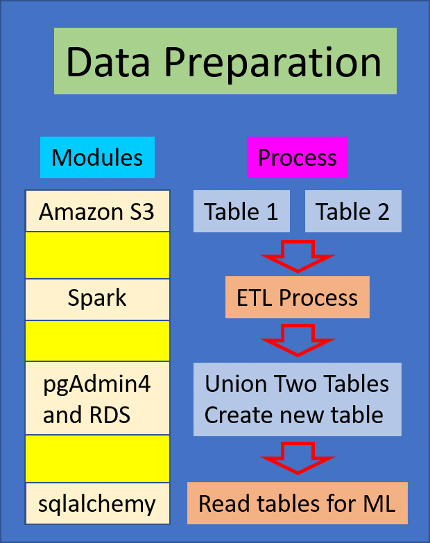
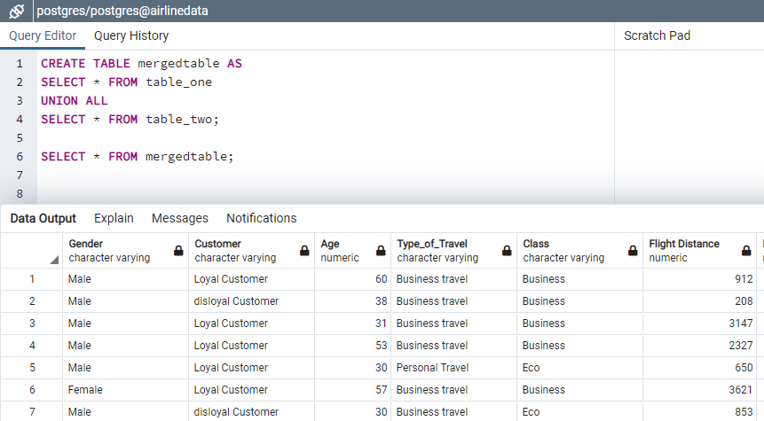

# Final_Project

## Subject: Airline Passenger Satisfaction

#### Airline_War

## Topic Background
In the aviation industry, high-grade customer satisfaction is a key factor to run the business, as the airline industry is very competitive and customer loyalty varies with small changes in the services. Therefore, companies need to understand the passengers’ need to deliver unparalleled experiences to retain customers. Using the airline passenger satisfaction data obtained from Kaggle, we will utilize machine learning models in order to understand the reasons for passenger experience being satisfied or not. Based on that, improvements will be made to provide better service by the airline company. Also, as part of the analysis, we will be able to understand several factors which improve customer satisfaction level. The results will then be pitched to airline executives to determine where things are going well and where there is room for growth and improvement. This will ultimately help retain and bring in more customers and profits for a sustainable business model.

## What We're Trying to Figure Out:
In our scenario, the airline company wants to identify a customer satisfaction level, based on ratings on various aspects of airline experience. Hence, we will build a supervised machine learning model to classify the customer satisfaction level. More specifically, we will classify customers being satisfied or not and accordingly try to find out the factors related to satisfaction.

## Questions we hope to answer with the data:
* What factors have the greatest impact on passenger satisfaction?
* What ML model results in the best classification technique for correlating survey data with satisfaction?
* https://public.tableau.com/profile/shannon3615#!/vizhome/Feature_Importance/Feature_Importance

## Technology
The detail technology we used is in the link

## Segment Summaries

**1. SQUARE:**

**Segment 1 (Subodh)**
We judiciously decided that we will explore and understand Airline Passenger Satisfaction Survey dataset by analyzing and creating some dashboards in Tableau. Please click the link below to view dashboards.
https://public.tableau.com/profile/subodh.byanjankar#!/vizhome/Air_Passengers/Air_Passenger?publish=yes

**Segment 2 (Shannon)**
https://docs.google.com/presentation/d/1fBrSa42y-jrsIntrrarsqPRVHqabnKQwzn656jAulDA/edit#slide=id.gbb319ac8ce_0_536

### Communication protocol
*** Meetings:
In addition to meeting on Monday and Wednesday evenings, the team created a slack channel titled group2. All additional meetings were scheduled through the slack channel. We scheduled google meets or zoom calls on weekends at least once or twice outside of class hours per week to review the submission for the week and determine roles for the upcoming week. 

*** Document Organization:
The team decided to create a file for each week in the team's Github repository. The first week submission materials are located in the "main" branch and the documents for week 2 are located in the "week2" branch. Week 3 documents are located in "Week3" branch and finally the final submission is located in the "Week-4" branch.

*** Communication between meetings:
The group2 slack channel was used to communicate meeting time updates and share code/links.

**2. TRIANGLE:**

**Segment 1 (Shannon)**
Through Colab, the Pandas technology was used to set-up the Machine Learning model. First, a table was read from a Postgres database into a Pandas dataframe. The features (X) and target (y) were created and all data was transferred to numerical data with the "get dummies" and "label encoder" functions. The dataframe was then split into train and test dataframes with 75% of the data for the test array and 25% of the data for the train arrays. Next steps include a determination of a machine learning model that will result in the highest accuracy. 

**Segment 2 (Subodh)**
ML Descriptions and explanations

**3. CIRCLE- Reno**

**Segment 1 (Reno)**
For the first segment, we took on the database development and management role. One of the challenges we faced initially was coming to a consensus on a dataset to use. There were many options to choose from, but ultimately we decided on predicting satisfaction levels for airplane passengers on US flights. The original dataset came with a test and train dataset. For the purposes of having a larger dataset for a better performance on the machine learning model, we decided to concatenate the two files into one with each entry being a unique passenger. We started by creating a new relational database (RDS) on the cloud using Amazon Web Services (AWS). We also uploaded the raw data csv files using S3 in AWS. 

From here, we then used Spark in Google Colab to preprocess and clean the data. We dropped the 'id' and index columns because we didn't see much value in keeping them and then proceeded to drop NAs in the dataset. Simulataneously, we then used the GUI, pgAdmin 4, to create the database schema based off the columns in the finalized dataset. From there, we renamed the columns in Colab to ensure they matched the column names in the schema. After the preprocessing was completed, we then loaded the dataset into a provisional database in PostgresSQL. Finally, we utilized SQL Alchemy to read the Postgres database into Pandas in order for the person in the Traingle role to execute machine learning models. 

**Segment 2 (Sungil)**
Union two tables in pgAdmin4- just showing code, but not executing it because of project requirement to have two separate tables (test and train in our case).

**4. X**

**Segment 1 (Sungil)**
The X role will focus on the technology side of the project and provide which tools and modules are the best fit for the team project. All of the technology components play a large part in project efficacy, so knowing them beforehand helps smooth the workflow. The details of technologies we will use is issustrated in the prior section.

**Segment 2 (Reno)**
Start Tableau dashboard/story

https://public.tableau.com/profile/reno.stephens#!/vizhome/Airline_16131444843650/AirlinePassengerSatisfactionStory

## Data source: US Airline passenger satisfaction survey
Source : https://www.kaggle.com/teejmahal20/airline-passenger-satisfaction

**Data process diagram**

**Database Workflow**

**Union two tables using pgAdmin4**

## Machine Learning Model

We chose the Airline Passenger dataset from Kaggle for Machine Learning model and initially ran Logistic Regression Model. Since, our dataset was already split intro train and the test dataset, that didn't necessisate us to split the dataset. 

For pre processing purpose we imported the dataset from AWS using Python libraries such as numpy and pandas, then dropped the dependent variable "satisfaction", created dummy datasets for both test and the train dataset creating features. After creating a dummy dataset, new satisfaction targets were created and converted the text labels to numerical values.

## ML Model 1: Logistic Regression

After both train and test datasets were pre-processed, Logistic Regression model was run to get prediction and actual outcomes with the accuracy of 77.43% for test dataset. 

Confusion Matrix

The confusion matrix for the test dataset from Logistic Regression showed that the classifier was accurate 77.43% and misclassification rate is 22.57%. The model predicted the true positivity rate to be 80.20% which is also a precision rate. The true negative and false positive rate is 73.97% and 20.05% respectively. The sensitivity rate which calculates how well the test can identify true positive is 79.37% whereas sepcificity rate which results in how well the test can identify true negative is 74.95% and prevalense rate that calculates how often the yes condidtion occurs in the sample is 43.89%.

Classification Report

The classification report for train dataset showed that the accuracy rate is 77% which is very close to accuracy rate of test dataset. 0 i.e. neutral or dissatisfaction has 6% higher precision rate than 1 i.e. satisfaction rate and neutral or dissatisfaction rate has 4% higher recall rate than satisfaction rate. The f1-score, which is harmonic mean between precision and recall rate is 80% for dissatisfaction rate and 74% for satisfaction rate.

## ML Model 2: Random Forest Classifier

After both train and test datasets were pre-processed, Random Forest Classifier model was run to get prediction and actual outcomes with the accuracy of 86.59% for test dataset.

Confusion Matrix

The confusion matrix for the test dataset from Random Forest Classifier showed that the classifier was accurate 86.59% and misclassification rate is 13.41%. The model predicted the true positivity rate to be 85.08% which is also a precision rate. The true negative and false positive rate is 88.92% and 20.68% respectively. The sensitivity rate which calculates how well the test can identify true positive is 92.27% whereas sepcificity rate which results in how well the test can identify true negative is 79.32% and prevalense rate that calculates how often the yes condidtion occurs in the sample is 43.89%.

Classification Report

The classification report for train datased showed that the accuracy rate is 87% which is very close to accuracy rate of test dataset. 0 i.e. neutral or dissatisfaction has 4% lower precision rate than 1 i.e. satisfaction rate and neutral or dissatisfaction rate has 13% higher recall rate than satisfaction rate. The f1-score, which is harmonic mean between precision and recall rate is 89% for dissatisfaction rate and 84% for satisfaction rate.

## ML Model 3: Support Vector Machine

After both train and test datasets were pre-processed, Support Vector Machine model was run to get prediction and actual outcomes with the accuracy of 87.07% for test dataset.

Confusion Matrix

The confusion matrix for the test dataset from Support Vector Machine showed that the classifier was accurate 87.07% and misclassification rate is 12.93%. The model predicted the true positivity rate to be 87.17% which is also a precision rate. The true negative and false positive rate is 86.93% and 16.98% respectively. The sensitivity rate which calculates how well the test can identify true positive is 90.24% whereas sepcificity rate which results in how well the test can identify true negative is 83.02% and prevalense rate that calculates how often the yes condidtion occurs in the sample is 43.89%.

Classification Report

The classification report for train datased showed that the accuracy rate is 87% which is very close to accuracy rate of test dataset. 0 i.e. neutral or dissatisfaction has an equivalent precision rate as 1 i.e. satisfaction rate and neutral or dissatisfaction rate has 7% higher recall rate than satisfaction rate. The f1-score, which is harmonic mean between precision and recall rate is 89% for dissatisfaction rate and 85% for satisfaction rate.

## ML Models on Select Features with R>0.4 on satisfaction

The random forest classifier reported the same consistent accuracy score of 86%, while the accuracy score decreased for the SVM model and increased for the Logistic Regression Model. The four features we included this time around included: Online boarding (R=0.5), class (R=0.49), type_of_travel (R=0.45), and inflight entertainment (R=0.4). We set an arbitrary threshold of R>0.4 in order to be included in the final select features. Whether it was 27 features or 4, the Random Forest Classifier stayed the most consistent with accuracy and also had the least number of false positives, in this case meaning 1,355 passengers were misclassified as being dissatisfied or neutral when they should have actually been classified as satisfied.

## Discussion

-What ML model results in the best classification technique for correlating survey data with satisfaction?

* Random Forest Classifier 
* Consistent Accuracy of 86% with original 22 features and 4 features with R>0.4
* Least # of False Positives

-Online boarding allows the passenger to check-in in advance of their flight using either the airline's website or app; online boarding is useful for both the passengers and airline staff as it reduces cost by requiring less paper and less staff at check-in counters and saves a lot of time, which in turn saves money for the airline and allows them to provide cheaper flights to customers; it's super convenient because the passenger no longer has to wait in a long line and can simply go straight to security once they arrive to the airport for their flight, saving hours of their time

-Having satisfaction on a likert scale from 0-5 would provide better insight on on overall passenger satisfaction rather than a binary scale, because there's a difference between satisfactory and excellent that isn't accounted for with a binary scale

-Weighing in ratings for all the variables as measure satisfied and neutral and dissatisfied rate on weighted average

## Future Analyses

-Create more detailed survey with 4 select features 

-Research passenger satisfaction based on:
* Airlines
* Airport
* Type of Airlplane
* Safety track record
* Ticket price

## Limitations

-Original source of dataset is unknown (e.g. credibility and date of data)

-Data dictionary provided is very vague (e.g. lack of distinct difference between online boarding and check in )

