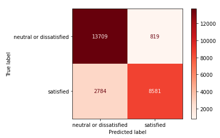
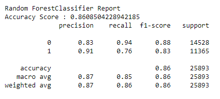
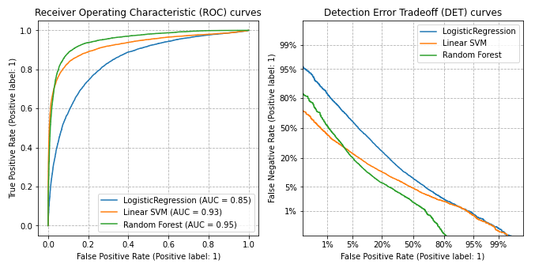

# Final_Project

## Subject: Airline Passenger Satisfaction

## Reason selecting the topic:
Increasing customer satisfaction is a key element for modern businesses  because it not only improves the quality of customer service, but also determines the success or failure of the business in the end. In order to meet customer expectations and achieve higher quality levels, we need to develop a specific model of passenger satisfaction measurement. In this project we use the airline passenger satisfaction survey to show how the machine learning models can be utilized in order to measure passengers’ satisfaction from a variety set of services dimensions, as well as to indicate those dimensions that need to be improved.

## Questions we hope to answer with data:
* What factors the keys to airline passenger satisfaction?
* It is know if a new customer can be satisfied or not, basing on his  personnal information such as : gender, age, type of travel ... ?
* How we can improve the machine learning classification technique to understand the key features that correlate to the variable which is being predicted.

## Role : 
**In week 1: X Role**

The X role will focus on the technology side of the project and provide which tools and what moduls are the best fit for the team project? All of the technology components play a large part in project efficacy, so knowing them beforehand helps smooth the workflow. The details of technologe we will use is issustrated in the following section.

## Technology we used
The detail technology we used is in the link

**In week 2: CIRCLE Role**

 We used Amazon simple stoage service (S3) to store two csv files for airplane service satification data. We then used Spark in Google Colab to preprocess, clean the data and upload data to postgresql. This SQL databae is linked relational database (RDS) on the cloud Amazon Web Services (AWS).
 Herein we unioned two tables using pgadmin4 and use the merged file to run a machine learning program, SciKitLearn, in Pandas. 
 The sql quary file to union two tables is displayed in the following link.

https://github.com/Subodh2044/Final_Project/blob/Week2/Database/union_and_createtable.sql

**In week 3: Triangle Role**

## Data source: US Airline passenger satisfaction survey
Source : https://www.kaggle.com/teejmahal20/airline-passenger-satisfaction

**Data process diagram**

*Union two tables using pgAdmin4 **

**Data correlation table using seabone heatmap plot**

Plot shows that "Gender" and "Gate_location" are not relating to the "satisfaction". We can delete the "Gender" and "Gate_location" for ML.

## Random forest classifier

 * A random forest is a meta estimator that fits a number of decision tree classifiers on various sub-samples of the dataset and uses averaging to improve the predictive accuracy and control over-fitting.
 
 * Confusion matrix

 - It is a specific table that allows visualization of the performance of an algorithm with two rows and two columns that reports the number of true positives (TP), false positives(FP)), false negatives (FN), and true negatives (TN).

Out of 14528 actual N or dissatisfied reviewers, 13709 were predicted to be N or dissatisfied (positive), which we call **true positives (TP)**.
Out of 14528 actual N or dissatisfied reviewers (), 819 were predicted to be satisfied (nagative), which are considered **false negatives (FN)**.
Out of 11365 actual satisfied reviewers, 2784 were predicted to be N or dissatisfied (positive), and are considered **false positives**.
Out of 11365 actual satisfied reviewers, 8581 were predicted to be satisfied (nagative) and are considered **true negatives**.

 * Classification report

The **precision** will be "how many are correctly classified among that class"

**Precision = TP/(TP + FP) = (13709/(13709 +2784)) =0.831**

The **recall** means "how many of this class you find over the whole number of element of this class"

**recall (sensitivity) = TP/(TP + FN)=(13709/(13709 +819)) =0.943**

The **f1-score** is the harmonic mean between precision & recall

**F1 = 2(Precision * Sensitivity)/(Precision + Sensitivity) = 2*(0.831*0.943)/(0.831+0.943=0.884**

The **support** is the number of occurence of the given class in the dataset (11425 for (TP + FP) and 11365 for (FP + TN), which is a really well balanced dataset.

## ROC and DET curve

 * A receiver operating characteristic (ROC) curve is a graphical plot that illustrates the diagnostic ability of a binary classifier system. The ROC curve is created by plotting the true positive rate (TPR, probability of detection) against the false positive rate (FPR, probability of false alarm) at various threshold settings. 

 * Area under the curve (AUC) is equal to the probability that a classifier will rank a randomly chosen positive instance higher than a randomly chosen negative one (assuming 'positive' ranks higher than 'negative').

 * A detection error tradeoff (DET) graph is a graphical plot of error rates for binary classification systems, plotting the false negative rate (Miss rate) vs. false positive rate.

