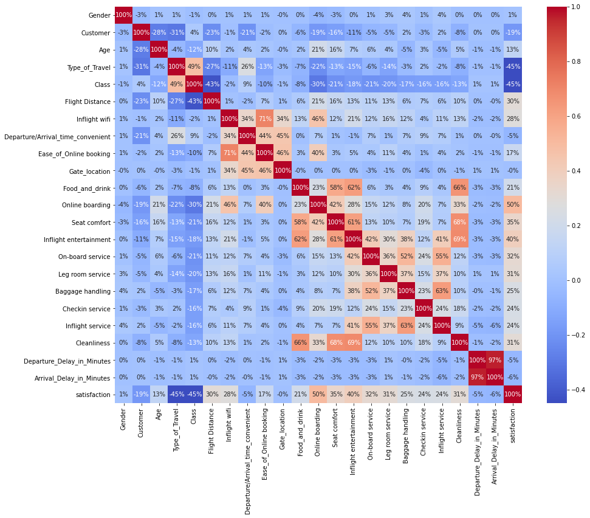

# Final_Project

## Subject: Airline Passenger Satisfaction

## Reason selecting the topic:
Increasing customer satisfaction is a key element for modern businesses  because it not only improves the quality of customer service, but also determines the success or failure of the business in the end. In order to meet customer expectations and achieve higher quality levels, we need to develop a specific model of passenger satisfaction measurement. In this project we use the airline passenger satisfaction survey to show how the machine learning models can be utilized in order to measure passengers’ satisfaction from a variety set of services dimensions, as well as to indicate those dimensions that need to be improved.

## Questions we hope to answer with data:
* What factors the keys to airline passenger satisfaction?
* It is know if a new customer can be satisfied or not, basing on his  personnal information such as : gender, age, type of travel ... ?
* How we can improve the machine learning classification technique to understand the key features that correlate to the variable which is being predicted.

## Role : X Role
The X role will focus on the technology side of the project and provide which tools and what moduls are the best fit for the team project? All of the technology components play a large part in project efficacy, so knowing them beforehand helps smooth the workflow. The details of technologe we will use is issustrated in the following section.

## Technology we used
The detail technology we used is in the link

## Filter-based feature selection
**Correlation Table**

**Correlation Pair Plot**

From the correlation analysis, Gender and Gate_location are no significant role for satisfaction. We drop this factors for airline satisfaction prediction.  