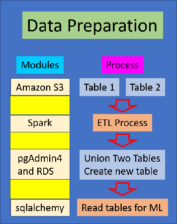

# Final_Project

## Subject: Airline Passenger Satisfaction

#### Airline_War

## Reason selecting the topic:
Increasing customer satisfaction is a key element for modern businesses because it not only improves the quality of customer service, but also determines the success or failure of the business in the end. In order to meet customer expectations and achieve higher quality levels, we need to develop a specific model of passenger satisfaction measurement. In this project we use the airline passenger satisfaction survey to show how the machine learning models can be utilized in order to measure passengers’ satisfaction from a variety set of service dimensions, as well as to indicate those dimensions that need to be improved.

## Questions we hope to answer with the data:
* What factors are key to airline passenger satisfaction?
* Is it known if a new customer can be satisfied or not, based on their personal information such as : gender, age, type of travel ... ?
* How can we improve the machine learning classification technique to understand the key features that correlate with the variable being predicted?

## Technology
The detail technology we used is in the link

## Segment Summaries

**1. SQUARE:**

**Segment 1 (Subodh)**
We judiciously decided that we will explore and understand Airline Passenger Satisfaction Survey dataset by analyzing and creating some dashboards in Tableau. Please click the link below to view dashboards.
https://public.tableau.com/profile/subodh.byanjankar#!/vizhome/Air_Passenger/Story1?publish=ye

**Segment 2 (Shannon)**
https://docs.google.com/presentation/d/1fBrSa42y-jrsIntrrarsqPRVHqabnKQwzn656jAulDA/edit#slide=id.gbb319ac8ce_0_536

### Communication protocol
*** Meetings:
In addition to meeting on Monday and Wednesday evenings, the team created a slack channel titled group2. All additional meetings were scheduled through the slack channel. We scheduled google meets on weekends to review the submission for the week and determine roles for the upcoming week. 

*** Document Organization:
The team decided to create a file for each week in the team's Github repository. The first week submission materials are located in the "main" branch and the documents for week 2 are located in the "week2" branch. Week 3 and 4 documents will be located in "Week3" and "Week4" branches, respectively.

*** Communication between meetings:
The group2 slack channel was used to communicate meeting time updates and share code/links.

**2. TRIANGLE:**

**Segment 1 (Shannon)**
Through Colab, the Pandas technology was used to set-up the Machine Learning model. First, a table was read from a Postgres database into a Pandas dataframe. The features (X) and target (y) were created and all data was transferred to numerical data with the "get dummies" and "label encoder" functions. The dataframe was then split into train and test dataframes with 75% of the data for the test array and 25% of the data for the train arrays. Next steps include a determination of a machine learning model that will result in the highest accuracy. 

**Segment 2 (Subodh)**
ML Descriptions and explanations

**3. CIRCLE- Reno**

**Segment 1 (Reno)**
For the first segment, we took on the database development and management role. One of the challenges we faced initially was coming to a consensus on a dataset to use. There were many options to choose from, but ultimately we decided on predicting satisfaction levels for airplane passengers on US flights. The original dataset came with a test and train dataset. For the purposes of having a larger dataset for a better performance on the machine learning model, we decided to concatenate the two files into one with each entry being a unique passenger. We started by creating a new relational database (RDS) on the cloud using Amazon Web Services (AWS). We also uploaded the raw data csv files using S3 in AWS. 

From here, we then used Spark in Google Colab to preprocess and clean the data. We dropped the 'id' and index columns because we didn't see much value in keeping them and then proceeded to drop NAs in the dataset. Simulataneously, we then used the GUI, pgAdmin 4, to create the database schema based off the columns in the finalized dataset. From there, we renamed the columns in Colab to ensure they matched the column names in the schema. After the preprocessing was completed, we then loaded the dataset into a provisional database in PostgresSQL. Finally, we utilized SQL Alchemy to read the Postgres database into Pandas in order for the person in the Traingle role to execute machine learning models. 

**Segment 2 (Sungil)**
Add info about SQL code (union)- just showing code

**4. X**

**Segment 1 (Sungil)**
The X role will focus on the technology side of the project and provide which tools and modules are the best fit for the team project. All of the technology components play a large part in project efficacy, so knowing them beforehand helps smooth the workflow. The details of technologies we will use is issustrated in the prior section.

**Segment 2 (Reno)**
Start Tableau dashboard/story

For Segment 2, we created the majority of our graphics and visualizations using Tableau sheets, dashboards, and a story combining the 3 dashboards. While the dataset contains a large amount of data points, we had to make a bit of a stretch with some of analyses given the rather neglibile differences in satisfaction values for each of the features of interest that we included. The largest positive correlation was for Online Boarding with a value difference of 1.3672 and the largest negative correlation was for Departure/Arrival Time Convenient with a value difference of -0.1672.

For the first dashboard of the story, you'll notice that there was very little difference amongst females and males when compared across each of the features of interest we included in the anlysis. When looking at various age groups in comparison to the features of interest, we decided to bucket the ages into 5 unique groups (0-17, 18-35, 36-50, 51-70, and 71+). We did this because when looking at the overall distribution of the data across all ages, it made most sense to bucket it this way, with most of the data packed amongst middle-aged passengers. The average values of each feature of interest shifted a bit with increasing age, however the most notable differences were for Online Boarding specifically between age group '18-35' to '36-50' as well as the drop in the average value of Departure/Arrival Time Convenient between those same two age groups. The only other somewhat noticeable difference was the drop in some of the average values once you reach the '71+' age group.

Finally, the main takeaway from the third and final dashboard in the story was that seniors and middle aged passengers travel the furthest on average, but loyalty to an airline does play an important factor in determining the average flight distance traveled for passenger. Also, when looking at the type of customer, type of travel, and flight class, one might reasonably expect a loyal customer traveling for business in business class to provide the highest overall ratings for most, if not all the features of interest we analyzed. However, interestingly enough, we found disloyal passengers traveling for personal travel in business scored highest on average for Departure/Arrival Time Convenient, disloyal passengers traveling for personal travel in Eco Plus class scored the highest on average for Inflight Service and On-board Service. 

Separate from the Tableau story found in the link below, we also utilized the seaborn library to create various correlation plots to better visualize the relationships between our numerical variables (we encoded satisfaction as a numerical variable as well to be included). A correlation matrix was created that showed Online Boarding having the highest correlation with satisfaction, but only .5, which is pretty weak overall. Additionally, a pairwise plot was created to allow us to see both distribution of single variables and relationships between two variables, while a regression was added to the last pairwise plot. Last but not least, a bar chart showcasing the ranked correlations of each of the features in relation to the outcome variable of satisfaction was created confirming what was found in the initial explortatory data analysis phase in Tableau.

https://public.tableau.com/profile/reno.stephens#!/vizhome/Airline_16131444843650/AirlinePassengerSatisfactionStory

## Data source: US Airline passenger satisfaction survey
Source : https://www.kaggle.com/teejmahal20/airline-passenger-satisfaction

**Data process diagram**

*Union two tables using pgAdmin4 **

*SQL data file to union two tables
https://github.com/Subodh2044/Final_Project/blob/Week2/Database/union_and_createtable.sql

## Machine Learning Model

We chose the Airline Passenger dataset from Kaggle for Machine Learning model and initially ran Logistic Regression Model. Since, our dataset was already split intro train and the test dataset, that didn't necessisate us to split the dataset. 

For pre processing purpose we imported the dataset from AWS using Python libraries such as numpy and pandas, then dropped the dependent variable "satisfaction", created dummy datasets for both test and the train dataset creating features. After creating a dummy dataset, new satisfaction targets were created and converted the text labels to numerical values.

After both train and test datasets were prep processed, Logistic Regression model was run to get prediction and actual outcomes with the accuracy of 80.94% for train and 81.26% for test dataset.

Confusion Matrix

For the test dataset, there are two predicted classe 0 for satisfied and 1 for neutral/dissatisfied. The classifier made the total prediction of 129,465 and in those classifier, 14,725 were predicted to be satisfied but in reality 57,915 were satisfied whereas 47,290 were predicted to be neutral or dissatisfied but classifier resulted in 9,535 customer whose reviews suggested they were neutral or dissatisfied.

For the train dataset, there are two predicted classe 0 for satisfied and 1 for neutral/dissatisfied. The classifier made the total prediction of 621,564 and in those classifier, 71,970 were predicted to be satisfied but in reality 280,212 were satisfied whereas 222,924 were predicted to be neutral or dissatisfied but classifier resulted in 46,458 customer whose reviews suggested they were neutral or dissatisfied.
