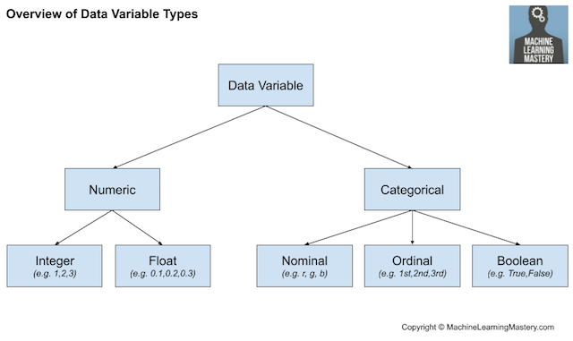
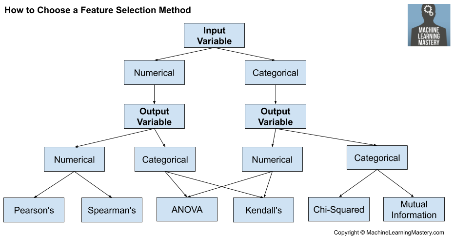

## Technologies

## 1. Data Cleaning and Analysis
Pandas in python module will be used to clean the data and perform an exploratory analysis. The Extract, Transform, Load (ETL) process to create data pipelines and spilt, encoding, train the model, and prediction will be completed using Python.

## 2. Database Storage
The technologies we utilized for the database development and management were AWS for creating the uploading the datasets to S3 and creating the relational database (RDS) in the cloud. We then used Spark for preprocessing (including dropping columns, renaming columns, dropping NAs, and concatenating data sets) and loading the dataset into a provisional database in Postgres using the GUI, pgAdmin4. Finally, we utilized SQL Alchemy to read the Postgres database into Pandas in order to execute machine learning.

## 3. Machine Learning
SciKitLearn is the Machine Learning library we'll be using to create a classifier and to train and test setup. Logistic Regression or Decision Tree Model will be applied to create the dicision classifier first, then, a specific algorithm, like Random Forests, GradientBoostedTree, and XGBoost will be cobined with the weak learners. A single weak learner will make inaccurate and imprecise predictions because they are poor at learning adequately as result of limited data, like too few features, or using data points that can't be classified; however, the weak learners are
valuable because there are models that can combine many weak learners
to create a more accurate and robust prediction engine. From the Ensemble Learning, the final prediction is based on the accumulated predictions from each algorithm.

## 4. Dashboard 
We judiciously decided that we will explore and understand Airline Passenger Satisfaction Surevey dataset by analyzing and creating some dashboards in Tableau. Please click the link below to view dashboards. https://public.tableau.com/profile/subodh.byanjankar#!/vizhome/Air_Passenger/Story1?publish=ye

## 5. Statistics for Filter-Based Feature Selection Methods
Feature selection methods are intended to reduce the number of input variables to those that are believed to be most useful to a model in order to predict the target variable.

Common data types include numerical (such as height) and categorical (such as a label), although each may be further subdivided such as integer and floating point for numerical variables, and boolean, ordinal, or nominal for categorical variables.

*Data_Variable_Types

### Statistical measurement method

**The scikit-learn library provides an implementation of most of the useful statistical measures.**

**Feature_Selection_Methods**

**Common regression predictive modeling with different input and output variables.**

**Numerical Input, Numerical Output**

* Pearson’s correlation coefficient (linear)
* Spearman’s rank coefficient (nonlinear)

**Numerical Input, Categorical Output**

* ANOVA correlation coefficient (linear)
* Kendall’s rank coefficient (nonlinear)

**Categorical Input, Numerical Output**

* ANOVA correlation coefficient (linear)
* Kendall’s rank coefficient (nonlinear)

**Categorical Input, Categorical Output**

* Chi-Squared test (contingency tables)
* Mutual information (information gain) from the field of information theory
