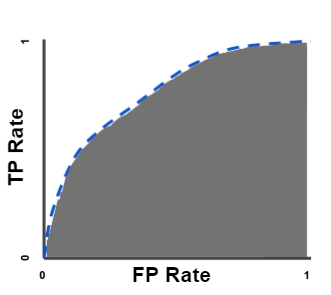

## Technologies

## 1. Data Cleaning and Analysis
Pandas in python module will be used to pre-process the data and perform an exploratory analysis. The Extract, Transform, Load (ETL) process to create data pipelines and spilt, encoding, train the model, and prediction will be completed using Python.

## 2. Database Storage
We created a publicly accessible S3 bucket with our two datafiles uploaded to followed by a Database instance with a relational database to connect to our local PostgreSQL server database. We used PySpark to conduct the initial data cleaning of both files and then loaded the data into the Postgre SQL database in the gui pg Admin 4 where we created an ERD to develop a table for the test and train datasets. From here, we utilized SQL alchemy to read the data from the database into pandas for preprocessing and to begin the machine learning process.

## 3. Machine Learning
SciKitLearn is the Machine Learning library we'll be using to create a classifier and to train and test setup. Logistic Regression or Decision Tree Model will be applied to create the dicision classifier first, then, a specific algorithm, like Random Forest Classifier, Support Vector Machine, GradientBoostedTree, and XGBoost will be cobined with the weak learners. A single weak learner will make inaccurate and imprecise predictions because they are poor at learning adequately as result of limited data, like too few features, or using data points that can't be classified; however, the weak learners are valuable because there are models that can combine many weak learners to create a more accurate and robust prediction engine. From the Ensemble Learning, the final prediction is based on the accumulated predictions from each algorithm.

## 4. Dashboard/Visualizations 
We judiciously decided that we will explore and understand Airline Passenger Satisfaction Surevey dataset by analyzing and creating some dashboards in Tableau. Please click the link below to view dashboards. https://public.tableau.com/profile/subodh.byanjankar#!/vizhome/Air_Passenger/Story1?publish=ye, https://public.tableau.com/profile/reno.stephens#!/vizhome/Airline_16131444843650/AirlinePassengerSatisfactionStory, https://public.tableau.com/profile/shannon3615#!/vizhome/Feature_Importance/Feature_Importance

We also utilized the seaborn and matplotlib libraries to create additional visualizations including a heat correlation matrix and feature rank bar chart to name a couple.

## 5. Filter-Based Feature Selection Methods
Feature selection methods are intended to reduce the number of input variables to those that are believed to be most useful to a model in order to predict the target variable.

Common data types include numerical (such as height) and categorical (such as a label), although each may be further subdivided such as integer and floating point for numerical variables, and boolean, ordinal, or nominal for categorical variables.

*Data_Variable_Types

### Statistical measurement method

**The scikit-learn library provides an implementation of most of the useful statistical measures.**

**Feature_Selection_Methods**

## Common regression predictive modeling with different input and output variables

**1. Numerical Input, Numerical Output**

* Pearson’s correlation coefficient (linear)
* Spearman’s rank coefficient (nonlinear)

**2. Numerical Input, Categorical Output**

* ANOVA correlation coefficient (linear)
* Kendall’s rank coefficient (nonlinear)

**3. Categorical Input, Numerical Output**

* ANOVA correlation coefficient (linear)
* Kendall’s rank coefficient (nonlinear)

**4. Categorical Input, Categorical Output**

* Chi-Squared test (contingency tables)
* Mutual information (information gain) from the field of information theory

## 5. ROC Curve

An ROC curve (receiver operating characteristic curve) is a graph showing the performance of a classification model at all classification thresholds. This curve plots two parameters:

1. True Positive Rate (TPR)
2. False Positive Rate (FPR)

Area under the ROC Curve (AUC) provides an aggregate measure of performance across all possible classification thresholds. One way of interpreting AUC is as the probability that the model ranks a random positive example more highly than a random negative example. AUC ranges in value from 0 to 1. A model whose predictions are 100% wrong has an AUC of 0.0; one whose predictions are 100% correct has an AUC of 1.0.

AUC is desirable for the following two reasons:

1. AUC is scale-invariant. It measures how well predictions are ranked, rather than their absolute values.
2. AUC is classification-threshold-invariant. It measures the quality of the model's predictions irrespective of what classification threshold is chosen.

* Source : https://developers.google.com/machine-learning/crash-course/classification

